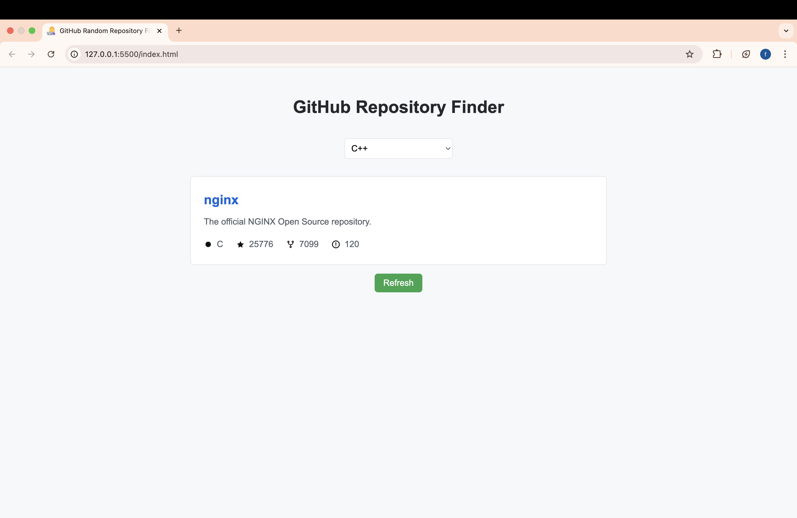

# GitHub Repository Finder

An interactive web application that helps users discover random GitHub repositories based on programming languages. This project is part of the frontend learning path from [roadmap.sh](https://roadmap.sh/frontend).

## Live Demo
[View Demo](https://faizaazam-1.github.io/GitHub-RepoFinder/)

## Preview

## States
1. Empty State: Initial view with language selection
2. Loading State: Shows spinner while fetching data
3. Success State: Displays repository information with refresh option
4. Error State: Shows error message with retry option

## API Integration
- Uses GitHub's public API for repository search
- Fetches programming languages list from external source
- Implements error handling for API failures

## Project Requirements
This project is created following the requirements from:
[https://roadmap.sh/projects](https://roadmap.sh/projects)

## Author
Faiza Azam
- GitHub: [@faizaazam-1](https://github.com/faizaazam-1)

